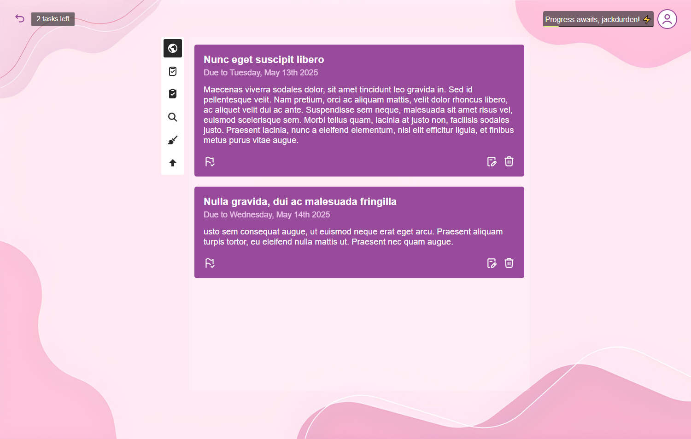
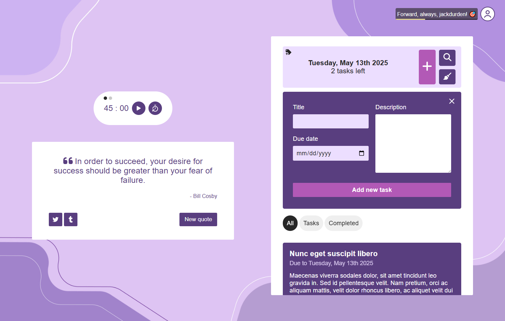

# TaskFlow – Minimalist Productivity, Maximum Focus


## 📋 About

[TaskFlow](https://taskflowapp.net/) is a handcrafted, fully custom single-page application designed to help you stay focused, motivated, and organized without distractions. It allows you to easily manage tasks, set reminders, and track your progress, all within a clean, user-friendly, and accessible interface that prioritizes simplicity and ease of use.

<br>

## 🚀 Features

- ✅ **Clean Task Management**: Streamline your task organization with a distraction-free interface designed for maximum efficiency and focus.
- 🧠 **Enhanced Manager View**: An intuitive and powerful layout for organizing, reviewing, and managing your tasks with ease.
- ⏱️ **Pomodoro Timer**: A comprehensive and accessible time management component built around the Pomodoro technique, designed to boost productivity through structured work-rest intervals.
- 💬 **Daily Motivation**: A dynamic motivational quote machine, delivering a rotating selection of quotes to inspire and motivate you throughout the day.
- 🗂️ **Offline or Online**: Effortlessly access your tasks offline via local storage or sync them when you're online, ensuring continuous management no matter your connection.
- 🔒 **Security First**: All connections are secured with HTTPS (A+ SSL Labs grade), utilizing secure JWT authentication and industry-standard practices for server hardening and encryption.
- 📱 **Responsive, Dynamic Interface Across All Devices**: The app is fully responsive, dynamically adjusting to desktops, tablets, mobiles, smartwatches, and any other device, with media queries and styled using pure vanilla CSS.
- 🚀 **Optimized Performance**: Achieved a full score in Google’s Lighthouse audit under standard conditions, ensuring top-tier performance, accessibility, best practices, and SEO. Performance may slightly vary (e.g., 97–99) when logged in or on mobile due to dynamic content and runtime features.

### 📊 Audit and Security Scores

Below are the actual audit and security test results demonstrating the app’s performance and integrity. Lighthouse scores are shown for both unauthenticated (anonymous) and authenticated users. These benchmarks validate the app’s speed, accessibility, and best practices under different conditions.


<br>

## 🧱 Core Features

- **Vanilla JavaScript SPA**, built from scratch with:
  - Modular MVC structure (models, views, controllers, and services)
  - Custom routing system and client-side navigation
  - Token-based auth management with automatic refresh
  - Device fingerprinting and fetch interception for security
  - Pomodoro timer, task management, quote engine, and theme rotation
  - Component-based UI (e.g., modals, user menu, loaders)
  - Optimized Lighthouse Scores with a full score across performance, accessibility, best practices, and SEO
  - HTTPS, ensuring secure and encrypted communication across the entire application
- **Secure RESTful API** written in **pure PHP**, featuring:
  - JWT-based Authentication and Refresh Tokens
  - CORS protection and strict request validation
  - Redis-backed rate limiting and IP/device rotation detection
  - Prepared statements and HTML escaping to prevent SQL injection and XSS
  - Environment-based configuration and maintenance mode
  - Structured routing with controller-based handlers
  - Centralized error/audit logging and graceful failure responses
- **MySQL Database**, normalized for clean relational task and user data handling:
  - users table: Stores user credentials and metadata.
  - refresh_tokens table: Stores refresh tokens and their expiration times.
  - tasks table: Stores tasks with due dates, descriptions, and completion statuses, with relationships to users.
  - quotes table: Stores motivational quotes.
  - user_logs table: Tracks user actions (inserts, updates, deletes) for auditing purposes.
  - Encrypted MySQL connections: Using an SSL certificate to ensure secure, encrypted communication between the application and the database.
- **Webpack + Babel**, for ES6+ support and bundling optimization
- **PHPMailer** integration for password recovery and transactional emails
- **Deployed API on Hardened Linux Server**:
  - SSH-only access, Fail2Ban, strict file permissions
  - HTTPS with an A+ SSL Labs grade, ensuring secure and encrypted communication across the entire application.

<br>

## 🧪 Local Development

```
Under development
```

<br>

## 📁 Further Documentation

Full architecture, API details, database design, and core components are available in the `docs/` directory:

- [architecture.md](./docs/architecture.md) – Full breakdown of the app structure and modules.
- [api.md](./docs/api.md) – REST API endpoints and usage.
- [design.md](./docs/design.md) – App scope and database schema and rationale.
- [about.md](./docs/about.md) – Project goals, challenges, and takeaways.

<br>

## 🌱 TaskFlow: Evolution, Features & Limitations

### **From Portfolio to Scalable Solution**

- **Started as a portfolio project** but evolved into a full-fledged productivity app.
- **Goal**: Simplify digital productivity with a task-focused experience.
- **Crafted with care**: Every aspect of TaskFlow, from frontend to backend, was thoughtfully developed to follow best practices, emphasizing security and user-focused design.

### Current Limitations

TaskFlow began as a portfolio project and, while ready for use as a full-fledged application, is currently limited by the SendGrid free tier, which restricts email sending to 100 emails per day. 

### Accessibility (a11y)

- **Inclusive Design**: TaskFlow is built with the goal of making the app accessible to all users, including those with disabilities. The interface is designed to be intuitive and easy to navigate, with continuous improvement in mind.
- **Keyboard Navigation**: TaskFlow is fully optimized for keyboard navigation, allowing users to interact with the app without relying on a mouse or touch input.
- **ARIA Support**: ARIA (Accessible Rich Internet Applications) attributes are used only when necessary, to enhance accessibility without cluttering the markup, ensuring an optimized experience for screen readers and assistive technologies.
- **Semantic HTML**: The app utilizes semantic HTML elements, not only for SEO benefits but also to improve the user experience, making it easier for assistive technology to interpret the content structure correctly.
- **Colorblind-Friendly**: The app’s theme handler offers multiple color schemes to cater to different preferences. However, I'm aware that it may not work well for users with colorblindness. Future updates will focus on adding color schemes that are more accessible and better aligned with accessibility standards.

### Architecture

- **Scalable Architecture**: The app is built with a modular design, including a dedicated MySQL database and an API hosted on a secure Linux server.
- **Transactional Emails**: TaskFlow supports key transactional emails such as account registration and password recovery, though the free tier limits email volume.
- **Scalability**: The system is built to scale, enabling easy future expansions and feature additions as needed.
- **Lightweight Custom SPA**: TaskFlow features a vanilla custom SPA that is lightweight and, like the rest of the project, does not rely on heavy libraries. It uses only essential development libraries, such as Webpack and Babel.
- **Optimized Client Build**: The client-side code is fully compiled and optimized using Babel and Webpack, ensuring modern JavaScript compatibility, enhanced performance, and faster load times.
- **Secure API**: The API is secured with modern security practices, including CORS, rate limiting, and JWT-based authentication. It is hosted on a modern, well-maintained server, ensuring data protection and preventing unauthorized access.
### Security First

- TaskFlow is designed with **strong security measures** to protect user data.
- However, **no app is completely secure**. Ongoing vigilance and improvements are always necessary due to the evolving nature of cybersecurity.

### Built for Growth

- **Modular design** ensures the app can scale with increasing user needs.
- **TaskFlow is more than just a task manager**. It is a showcase of clean architecture, efficient UX design, and scalable backend practices.

<br>

## 🖼️ Additional Images








<br>

## 📬 Contact

Feel free to reach out for feedback, collaboration, or opportunities:

- **GitHub**: [AngelValentino](https://github.com/AngelValentino)  
- **Email**: angelvalentino294@gmail.com

While I deeply value collaboration and community feedback, this project serves as a personal showcase of my software development and engineering skills. For that reason, I personally implement all features and improvements.

That said, I welcome **issues**, **suggestions**, and **feedback** — and I’ll consider **pull requests for bugs or non-feature enhancements** on a case-by-case basis.

If the project evolves into a team-led initiative or a paid service in the future, collaboration may become a more active part of its development. Until then, thank you for your support and interest!