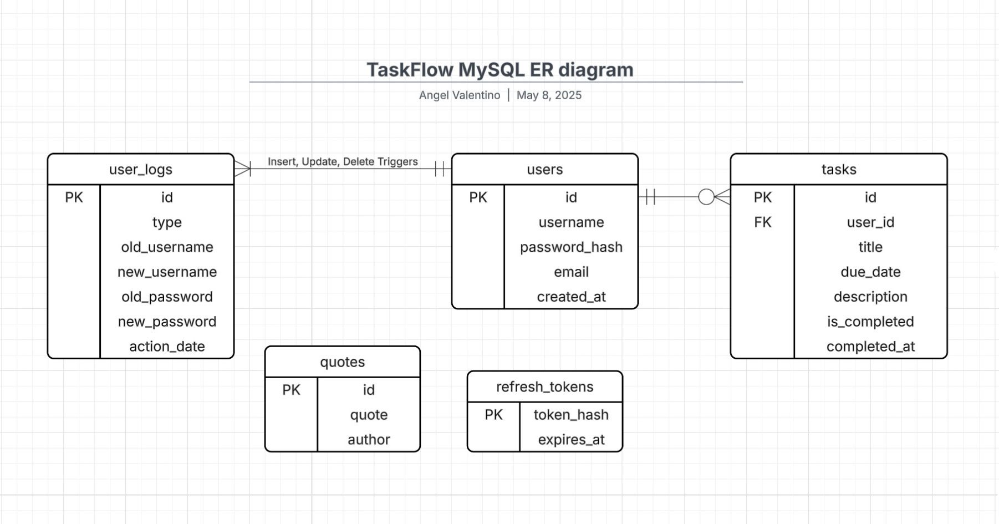

# Design Document of TaskFlow

This design document outlines the structure and role of the MySQL database used in **TaskFlow**, as well as the overall scope of the application. It serves to clearly define how data is stored, accessed, and managed, and ensures that both developers and stakeholders understand the responsibilities and limitations of the current system design.

## Scope

**TaskFlow** is a minimalist productivity application designed to help users stay focused, organized, and motivated. It began as a personal portfolio project, but has since evolved into a more robust and scalable platform. The app enables task management through a distraction-free interface, integrates the Pomodoro technique for effective time management, and provides users with daily motivational quotes.

Under the hood, TaskFlow is supported by a well structured MySQL database that manages core entities such as users, tasks, quotes, and activity logs. It also includes security mechanisms like JWT based authentication and refresh token tracking. The backend API is hosted on a Linux server, and the database is deployed on a separate, dedicated MySQL instance, ensuring better performance, modularity, and long term maintainability.

The only current limitation is the email tier, which relies on a free SendGrid plan subject to 100 emails per day. Aside from that, the infrastructure is built to last, with scalability and production-readiness in mind.

- **Users:** Contains information about each user, including their username, email, and password.

- **Tasks:** Represents tasks assigned to users. Each task is linked to its specific owner and all tasks are grouped here.

- **Refresh Tokens:** Stores JWT refresh tokens, allowing the API to track which tokens are whitelisted and which are not.

- **Quotes:** Includes motivational quotes that can later be fetched by the client 
requesting the API for display or use.

- **User Activity Logs:** Includes triggers for logging changes in user profiles (such as inserts, updates, or deletes) for tracking and security reasons.

### Out of Scope

The following elements are **out of scope** for the current application iteration and attached database:

- **External integrations:** No integration with third-party platforms or services, except for using SendGrid to send emails via port 2525.

- **Monetization or advertising:** The database does not support payment processing, monetization features, or advertising. The platform is completely free to use and non-intrusive.

- **Notifications:** General alerts or reminders are not included in this design. Notifications are limited to transactional purposes, such as sending password recovery emails or welcome messages upon user registration.

- **File storage:** While the database may reference external file storage in the future (e.g., for user profile pictures via CDNs), it will not handle actual file management.
  
## Functional Requirements

##### This current version of the application and its associated databas will support:

- **User Registration & Authentication**: Storing user credentials and handling JWT-based authentication.
- **Task Management**: Storing task details, completion status, and associated due dates.
- **Motivational Quotes**: Managing a collection of quotes for user motivation.
- **User Action Logs**: Keeps a record of changes made to user profiles, like edits or deletions, for tracking and security.

##### This existing application architecture and underlying database will not support:

- **Full user permissions**: Role-based permissions and advanced user management are excluded in this iteration.
- **Complex analytics**: Reporting or advanced statistics are out of scope for the current design.

## Representation

Entities are represented as **MySQL** tables, structured according to the following schema. An **Entity-Relationship (ER) diagram** is provided as a visual representation of the database structure.

### Entities

The database includes the following entities:

#### users

The `users` table contains user credentials and essential metadata:

- `id`: Specifies the unique ID for the user as an `INT UNSIGNED`. This column has the `PRIMARY KEY` constraint.
- `username`: Specifies the username of the user as a `VARCHAR(20)`. This column has the `UNIQUE` and `NOT NULL` constraints, ensuring each user has a unique username.
- `password_hash`: Stores the hashed password of the user as a `VARCHAR(255)`. This column has the `NOT NULL` constraint for security purposes.
- `email`: Specifies the email address of the user as a `VARCHAR(255)`. This column is `UNIQUE` and `NOT NULL`, ensuring each email address is distinct.
- `created_at`: Specifies the timestamp of when the user was created as a `TIMESTAMP`. The default value is `CURRENT_TIMESTAMP`, automatically set when a new user is added.

#### refresh_tokens

The `refresh_tokens` table stores the refresh tokens required for session management:

- `token_hash`: A `VARCHAR(64)` column that stores the hashed token used for session refresh. This column is `NOT NULL` and is the `PRIMARY KEY`.
- `expires_at`: An `INT UNSIGNED` column that stores the expiration time for the refresh token, ensuring it is valid only for a certain period.

#### tasks

The `tasks` table stores user tasks, including details such as title, due date, and completion status:

- `id`: Specifies the unique ID for the task as an `INT UNSIGNED`. This column has the `PRIMARY KEY` constraint.
- `user_id`: Specifies the `INT UNSIGNED` ID of the user to whom the task belongs. This column is a foreign key that references the `id` in the `users` table. Moreover, it has the `ON DELETE CASCADE` action to ensure no outdated records are kept.
- `title`: Specifies the title of the task as a `VARCHAR(75)`. This column has the `NOT NULL` constraint.
- `due_date`: Specifies the due date of the task as a `DATE`. This column has the `NOT NULL` constraint
- `description`: Provides a description of the task as a `VARCHAR(500)`. This column is optional and can be `NULL`.
- `is_completed`: A `BOOLEAN` column that indicates whether the task has been completed or not. The default value is `FALSE`.
- `completed_at`: Specifies the date the task was marked as completed as a `DATE`. This column is `NULL` by default, and is only set when `is_completed` is `TRUE`.

#### quotes

The `quotes` table stores motivational quotes to be shown to users:

- `id`: Specifies the unique ID for the quote as an `INT UNSIGNED`. This column has the `PRIMARY KEY` constraint.
- `quote`: Specifies the content of the quote as a `VARCHAR(500)`. This column has the `NOT NULL` constraint.
- `author`: Specifies the author of the quote as a `VARCHAR(75)`. This column has the `NOT NULL` constraint.

#### user_logs

The `user_logs` table records all changes made to user information for auditing purposes:

- `id`: Specifies the unique ID for the log entry as an `INT UNSIGNED`. This column has the `PRIMARY KEY` constraint.
- `type`: Specifies the log action type as an `ENUM('insert', 'update', 'delete')`. This column has the `NOT NULL` constraint.
- `old_username`: Specifies the old username before the update (if applicable) as a `VARCHAR(20)`. This column is optional and can be `NULL`.
- `new_username`: Specifies the new username after the update (if applicable) as a `VARCHAR(20)`. This column is optional and can be `NULL`.
- `old_password`: Specifies the old password hash before the update (if applicable) as a `VARCHAR(255)`. This column is optional and can be `NULL`.
- `new_password`: Specifies the new password hash after the update (if applicable) as a `VARCHAR(255)`. This column is optional and can be `NULL`.
- `action_date`: Specifies the timestamp of the log entry as a `TIMESTAMP`. The `DEFAULT` value is `CURRENT_TIMESTAMP`. Also, it has the `NOT NULL` constraint to ensure reliability.

This table is created through the `log_user_inserts`, `log_user_updates`, and `log_user_deletes` triggers to log changes made to sensitive user information for security purposes.

## Relationships

The below entity relationship diagram describes the relationships among the entities in the database.

## Optimizations

I strongly believe that further and extended optimization should not be implemented before we have a clear understanding of how users interact with the application, particularly with the database. While MySQL and other DBMS provide tools to analyze query performance, I believe the best approach is to wait for real data before optimizing the database. Implementing indexes prematurely can be risky, as it is uncertain whether they will be utilized as expected. Since adding indexes can slow down insertions, deletions, and updates, we must be cautious and avoid implementing them until we have actual user analytics and behavior data.

## Limitations

TaskFlow started as a portfolio project and, while currently limited by the SendGrid email subscription, is ready for use as a proper application. The app is built with a modular architecture, including a separate MySQL database and an API hosted on a Linux server. The app supports transactional emails, such as account registration and password recovery. The system is designed to scale, enabling straightforward expansions and the addition of new features as required.